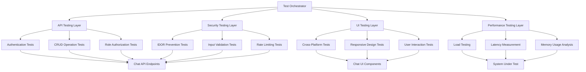

# Design Document: Chat Testing Specification

## Overview

This design document outlines a comprehensive testing framework for the existing chat functionality in a multi-role application. The testing specification covers functional validation, security assessment, performance benchmarking, and user experience verification across Admin, Parent, and Center user roles.

The testing framework is designed to validate the existing chat implementation which includes:
- Real-time messaging via Pusher WebSocket connections
- Role-based access control and authorization
- RESTful API endpoints for chat operations
- Cross-platform responsive UI components
- Message persistence and history management

The design emphasizes property-based testing approaches to ensure comprehensive coverage across all possible input combinations and edge cases, complemented by targeted unit tests for specific scenarios and integration tests for end-to-end validation.

## Architecture

### Testing Framework Architecture

The testing framework follows a multi-layered approach:



### Test Environment Architecture

The testing environment mirrors the production architecture:

1. **Frontend Testing Environment**
   - Next.js application with chat components
   - Pusher client connections for real-time testing
   - Browser automation for UI testing
   - Mobile device simulators for responsive testing

2. **Backend API Testing Environment**
   - RESTful API endpoints for chat operations
   - Authentication and authorization middleware
   - Database with test data for various scenarios
   - Pusher server for real-time event testing

3. **Security Testing Environment**
   - Isolated environment for vulnerability testing
   - Mock malicious payloads and attack vectors
   - Rate limiting and abuse prevention testing
   - IDOR and authorization bypass testing

## Components and Interfaces

### Core Testing Components

#### 1. API Test Suite
```typescript
interface ChatAPITestSuite {
  // Authentication testing
  testUnauthorizedAccess(): TestResult;
  testTokenExpiration(): TestResult;
  testRoleBasedAccess(): TestResult;
  
  // CRUD operations
  testSendMessage(): TestResult;
  testFetchMessages(): TestResult;
  testFetchConversations(): TestResult;
  testMarkAsRead(): TestResult;
  
  // Security validation
  testIDORPrevention(): TestResult;
  testInputValidation(): TestResult;
  testRateLimiting(): TestResult;
}
```

#### 2. Real-Time Testing Interface
```typescript
interface RealTimeTestSuite {
  // Pusher connection testing
  testPusherConnection(): TestResult;
  testChannelSubscription(): TestResult;
  testEventDelivery(): TestResult;
  
  // Message synchronization
  testMessageDelivery(): TestResult;
  testMultiUserSync(): TestResult;
  testOnlineStatusUpdates(): TestResult;
}
```

#### 3. UI Testing Interface
```typescript
interface UITestSuite {
  // Cross-platform testing
  testMobileResponsiveness(): TestResult;
  testTabletLayout(): TestResult;
  testDesktopInterface(): TestResult;
  
  // User interaction testing
  testMessageInput(): TestResult;
  testEmojiSupport(): TestResult;
  testFileAttachments(): TestResult;
  testScrollBehavior(): TestResult;
}
```

#### 4. Performance Testing Interface
```typescript
interface PerformanceTestSuite {
  // Latency measurement
  measureMessageDeliveryLatency(): PerformanceMetrics;
  measureAPIResponseTimes(): PerformanceMetrics;
  measureUIRenderingTime(): PerformanceMetrics;
  
  // Load testing
  testConcurrentUsers(): LoadTestResult;
  testMessageThroughput(): LoadTestResult;
  testMemoryUsage(): MemoryTestResult;
}
```

### Test Data Management

#### Test User Profiles
```typescript
interface TestUserProfile {
  id: string;
  role: 'admin' | 'parent' | 'center';
  authToken: string;
  permissions: string[];
  associatedUsers: string[]; // For role-based access testing
}
```

#### Test Conversation Scenarios
```typescript
interface TestConversation {
  id: string;
  participants: TestUserProfile[];
  messageCount: number;
  hasMediaAttachments: boolean;
  isLongRunning: boolean; // For performance testing
}
```

## Data Models

### Test Result Models

#### Base Test Result
```typescript
interface TestResult {
  testId: string;
  testName: string;
  status: 'passed' | 'failed' | 'skipped';
  executionTime: number;
  timestamp: Date;
  errorMessage?: string;
  metadata?: Record<string, any>;
}
```

#### Security Test Result
```typescript
interface SecurityTestResult extends TestResult {
  vulnerabilityType: 'IDOR' | 'XSS' | 'CSRF' | 'RateLimiting' | 'Authorization';
  severity: 'low' | 'medium' | 'high' | 'critical';
  exploitAttempted: boolean;
  mitigationVerified: boolean;
}
```

#### Performance Test Result
```typescript
interface PerformanceTestResult extends TestResult {
  metrics: {
    latency: {
      min: number;
      max: number;
      avg: number;
      p95: number;
      p99: number;
    };
    throughput: number;
    memoryUsage: number;
    cpuUsage: number;
  };
  benchmarkComparison: {
    baseline: number;
    current: number;
    improvement: number;
  };
}
```

### Test Configuration Models

#### API Test Configuration
```typescript
interface APITestConfig {
  baseURL: string;
  authTokens: Record<string, string>; // Role-based tokens
  rateLimitThresholds: {
    messagesPerMinute: number;
    requestsPerSecond: number;
  };
  timeouts: {
    connectionTimeout: number;
    responseTimeout: number;
  };
}
```

#### UI Test Configuration
```typescript
interface UITestConfig {
  browsers: ('chrome' | 'firefox' | 'safari' | 'edge')[];
  devices: {
    mobile: DeviceConfig[];
    tablet: DeviceConfig[];
    desktop: DeviceConfig[];
  };
  viewports: {
    width: number;
    height: number;
  }[];
}
```

## Error Handling

### Test Execution Error Handling

#### Error Classification
```typescript
enum TestErrorType {
  SETUP_ERROR = 'setup_error',
  EXECUTION_ERROR = 'execution_error',
  ASSERTION_ERROR = 'assertion_error',
  TIMEOUT_ERROR = 'timeout_error',
  NETWORK_ERROR = 'network_error',
  AUTHENTICATION_ERROR = 'auth_error'
}
```

#### Error Recovery Strategies
```typescript
interface ErrorRecoveryStrategy {
  errorType: TestErrorType;
  retryAttempts: number;
  retryDelay: number;
  fallbackAction: () => void;
  escalationThreshold: number;
}
```

### Test Environment Error Handling

1. **API Endpoint Failures**
   - Automatic retry with exponential backoff
   - Fallback to mock responses for non-critical tests
   - Detailed logging of failure reasons and context

2. **Real-Time Connection Failures**
   - Pusher connection retry mechanisms
   - WebSocket fallback strategies
   - Event delivery verification and retry

3. **UI Test Failures**
   - Screenshot capture on failure
   - DOM state preservation for debugging
   - Automatic browser restart for flaky tests

4. **Performance Test Failures**
   - Baseline comparison for anomaly detection
   - Resource cleanup after failed tests
   - Performance regression alerts

## Testing Strategy

### Dual Testing Approach

The testing strategy employs both unit testing and property-based testing to ensure comprehensive coverage:

**Unit Testing Focus:**
- Specific API endpoint behaviors
- UI component interactions
- Error condition handling
- Integration between components
- Edge cases and boundary conditions

**Property-Based Testing Focus:**
- Universal properties across all user roles
- Message delivery consistency properties
- Security invariants across all inputs
- Performance characteristics under various loads
- Data integrity properties

### Test Execution Strategy

#### 1. Continuous Integration Testing
- Automated test execution on code changes
- Smoke tests for critical chat functionality
- Regression testing for existing features
- Performance baseline validation

#### 2. Security Testing Schedule
- Daily automated security scans
- Weekly comprehensive vulnerability assessments
- Monthly penetration testing exercises
- Quarterly security audit reviews

#### 3. Performance Testing Cadence
- Real-time performance monitoring
- Daily performance regression tests
- Weekly load testing exercises
- Monthly capacity planning assessments

#### 4. Cross-Platform Testing Matrix
- Browser compatibility testing across major browsers
- Mobile device testing on iOS and Android
- Responsive design validation across viewport sizes
- Accessibility compliance verification

### Test Data Strategy

#### Test Data Generation
- Property-based test generators for user profiles
- Randomized conversation scenarios
- Synthetic message content with various formats
- Edge case data sets for boundary testing

#### Test Data Management
- Isolated test databases for each test suite
- Automated test data cleanup and reset
- Version-controlled test data sets
- Privacy-compliant synthetic data generation

### Reporting and Analytics

#### Test Result Reporting
- Real-time test execution dashboards
- Detailed test result analytics
- Trend analysis for test stability
- Performance regression tracking

#### Security Assessment Reporting
- Vulnerability assessment reports
- Security compliance scorecards
- Risk assessment matrices
- Remediation tracking and verification

#### Performance Benchmarking Reports
- Latency trend analysis
- Throughput capacity reports
- Resource utilization analytics
- Scalability assessment reports

## Correctness Properties

*A property is a characteristic or behavior that should hold true across all valid executions of a system—essentially, a formal statement about what the system should do. Properties serve as the bridge between human-readable specifications and machine-verifiable correctness guarantees.*

The following correctness properties define the universal behaviors that must hold across all valid inputs and scenarios for the chat testing system. Each property is designed to be implemented as a property-based test that validates the behavior across many generated test cases.

### Property 1: Role-Based Chat Access Control
*For any* user with a specific role (Admin, Parent, or Center) and any target user, chat initiation should succeed if and only if the role-based access rules permit the communication (Admin can chat with anyone, Parents only with assigned Centers, Centers only with enrolled Parents)
**Validates: Requirements 1.1, 1.2, 1.3**

### Property 2: Unauthorized Access Prevention
*For any* API request without valid authorization or attempting to access unauthorized resources, the system should return appropriate error codes (401 for missing auth, 403 for insufficient permissions) and prevent access
**Validates: Requirements 1.4, 2.1, 2.3**

### Property 3: Input Validation and Sanitization
*For any* message content that violates system constraints (length limits, malicious content), the system should reject invalid input, sanitize dangerous content, and return appropriate error responses
**Validates: Requirements 2.2, 2.4**

### Property 4: Rate Limiting Enforcement
*For any* user exceeding the configured rate limits for API requests or message sending, the system should enforce rate limiting by returning 429 errors and temporarily restricting access
**Validates: Requirements 2.5**

### Property 5: Message Delivery Consistency
*For any* message sent between authorized users, the message should be delivered to the recipient within the specified time limit and appear immediately in the sender's interface
**Validates: Requirements 3.1, 3.2**

### Property 6: Multi-User Message Synchronization
*For any* conversation with multiple participants, messages should appear in consistent chronological order across all participants' interfaces, regardless of network timing variations
**Validates: Requirements 3.3**

### Property 7: Online Status Propagation
*For any* user status change (online/offline), the updated status should propagate to all active conversations involving that user within the real-time system
**Validates: Requirements 3.4**

### Property 8: Message Persistence Round-Trip
*For any* message successfully sent, querying the message history should return the same message content, preserving all metadata and ensuring database consistency
**Validates: Requirements 4.1, 4.2**

### Property 9: Pagination Behavior for Large Conversations
*For any* conversation exceeding the pagination threshold, the system should implement proper pagination that maintains message order and provides complete history access
**Validates: Requirements 4.3**

### Property 10: State Recovery After Interruption
*For any* user session interrupted by browser refresh or network issues, the system should restore the complete chat state and synchronize any missed messages
**Validates: Requirements 4.4, 3.5**

### Property 11: Error Recovery and Retry Mechanisms
*For any* system failure (persistence, network, authentication), the system should implement appropriate retry mechanisms, preserve user data, and provide clear error feedback
**Validates: Requirements 4.5, 7.1, 7.2, 7.5**

### Property 12: Performance Under Load
*For any* system load within specified limits (concurrent conversations, message volume), performance metrics should remain within acceptable thresholds for latency, throughput, and resource usage
**Validates: Requirements 5.1, 5.2, 5.4, 5.5**

### Property 13: Non-Blocking File Processing
*For any* file attachment operations, other chat functionality should continue to operate normally without blocking or performance degradation
**Validates: Requirements 5.3**

### Property 14: Cross-Platform Responsive Behavior
*For any* device type or viewport size, the chat interface should maintain proper layout, functionality, and user interaction capabilities
**Validates: Requirements 6.1, 6.3**

### Property 15: Input Handling Consistency
*For any* user input (text, emojis, special characters) across different devices and browsers, the system should handle input consistently and preserve content integrity
**Validates: Requirements 6.2**

### Property 16: Error State User Experience
*For any* error condition encountered by users, the system should display appropriate error messages with clear recovery options and maintain system usability
**Validates: Requirements 6.4, 7.3**

### Property 17: Accessibility Compliance
*For any* accessibility feature or assistive technology used, the chat interface should provide equivalent functionality and proper navigation support
**Validates: Requirements 6.5**

### Property 18: Real-Time Connection Recovery
*For any* real-time connection failure (Pusher, WebSocket), the system should attempt reconnection with appropriate backoff strategies and maintain message delivery guarantees
**Validates: Requirements 7.4**

### Property 19: Comprehensive Security Event Logging
*For any* security-relevant event (unauthorized access, rate limiting, suspicious activity, IDOR attempts), the system should generate complete audit logs with sufficient context for investigation
**Validates: Requirements 8.1, 8.2, 8.3, 8.4, 8.5**

### Property 20: End-to-End Integration Consistency
*For any* complete chat workflow (send, deliver, persist, display), all system components should maintain data consistency and proper state transitions throughout the entire flow
**Validates: Requirements 9.1, 9.3, 9.5**

### Property 21: Role-Based Access Validation Across All Scenarios
*For any* combination of user roles and chat operations, the system should enforce proper access control consistently across all API endpoints and UI interactions
**Validates: Requirements 9.2**

### Property 22: Real-Time Event Integration
*For any* real-time event (message, status update, notification), the Pusher event delivery should result in appropriate UI updates and maintain system state consistency
**Validates: Requirements 9.4**

### Property 23: Performance Measurement and Reporting
*For any* performance test execution, the system should accurately measure and report detailed metrics including latency percentiles, throughput, and resource utilization
**Validates: Requirements 10.1, 10.2, 10.4**

### Property 24: Memory Usage Monitoring
*For any* active chat session, the system should track and report memory consumption per conversation and identify potential memory leaks or excessive usage
**Validates: Requirements 10.3**

### Property 25: Database Performance Analysis
*For any* database operation in the chat system, performance analysis should provide detailed timing information and optimization recommendations for query improvement
**Validates: Requirements 10.5**